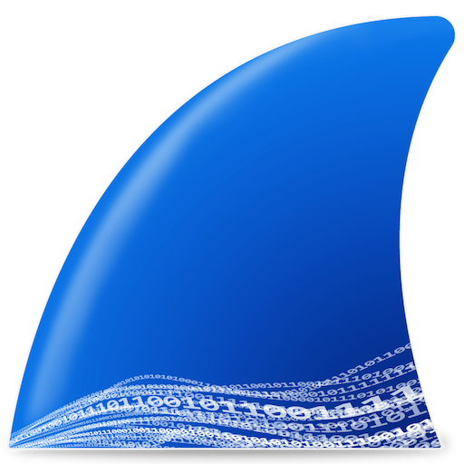
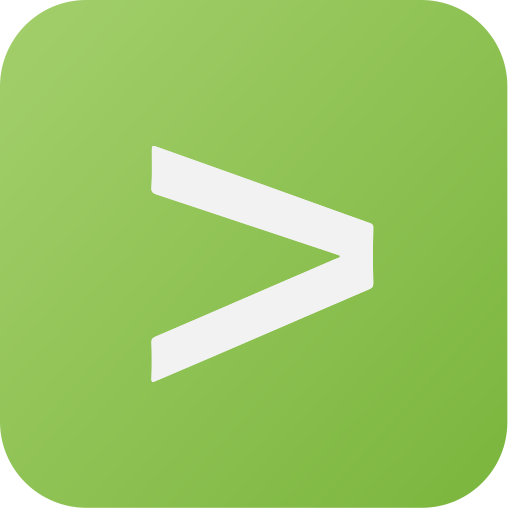
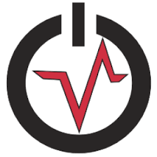
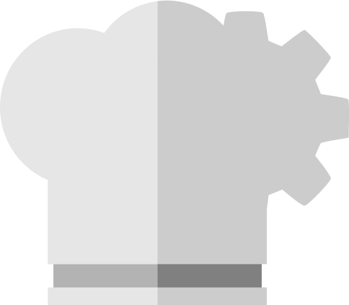
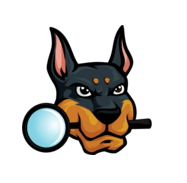
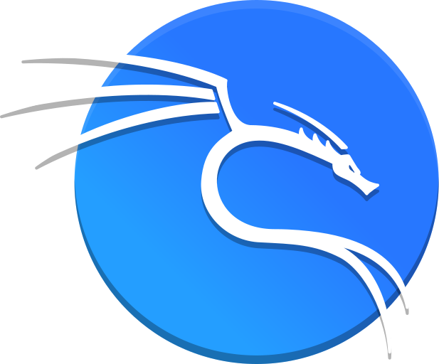
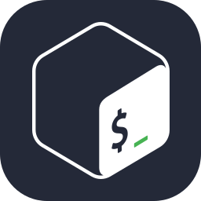

<h1 align="center"> Hi there, I'm <a href="https://www.linkedin.com/in/mira3zzeldin/">Mira</a> </h1>

<!--- Adding Header Elements -->

  <a href="https://www.linkedin.com/in/mira3zzeldin/">LinkedIn</a> -
  <a href="https://cyberdefenders.org/p/mira3zzeldin/">CyberDefenders</a> -
  <a href="https://tryhackme.com/p/mira3zzeldin">TryHackMe</a> - 
  <a href="https://hashnode.com/@mira3zzeldin">WriteUps</a> -
  <a href="https://www.credly.com/users/mira3zzeldin">Credly</a> -
  <a href="mailto:mira3zzeldin@gmail.com">Contact me.</a> 

---------------------------------------------------------

👨🏻‍💻 **About Me**  : Security Operations Center (SOC) Engineer | IT Graduate @ Mansoura University  
⚡ Check my ✨ [LinkedIn](https://www.linkedin.com/in/mira3zzeldin/) or 🌱 [WriteUps](https://rootshadow.hashnode.dev/) 
📫 How to reach me : Send an [Email](mailto:mira3zzeldin@gmail.com) or message me on Discord: **mira3zzeldin** 
👯 Seeking Synergy : Looking to join elite Blue Team & CTF Teams. 
💬 Knowledge Exchange: Let's discuss Threat Hunting, SIEM/Log Analysis, Network Forensics, and CTF Writeups.  

<!--- Adding Tech Stack open Section -->
<b>🛠 Tech Stack & Certifications</b> 

<table border="0" style="border-collapse: collapse; border: none; border-color: transparent;">
   <tr> <!--- Security Tools goes here -->
    <td style="vertical-align: middle;"><b>Security Tools : </b></td>
    <td></td>
    <td></td>
    <td></td>
    <td></td>
    <td></td>
    <td></td>
    <td></td>
    <td></td>
  </tr>
  
  <tr> <!--- Languages goes here -->
    <td style="vertical-align: middle;"><b>Languages : </b></td>
    <td></td>
    <td></td>
    <td></td>
    <td></td>
    <td></td>
    <td></td>
    <td></td>
    <td></td>
  </tr>
  <tr> <!--- Infrastructure and Labs goes here -->
    <td style="vertical-align: middle;"><b>Labs & OS : </b></td>
    <td></td>
    <td></td>
    <td></td>
    <td></td>
    <td></td>
    <td></td>
    <td></td>
    <td></td>
  </tr>
</table> 

<b>🗺️ My Defensive Cybersecurity Roadmap & Learning Path</b>
 
<table width="100%">
  <tr>
    <td>🔹 <b>Phase 00</b> - IT & Networking Fundamentals (Cisco Paths)</td>
    <td align="center">🟦🟦🟦🟦🟦🟦🟦🟦🟦🟦🟦🟦🟦🟦🟦🟦🟦🟦🟦🟦</td>
  </tr>
  <tr>
    <td>🐧 <b>Phase 01</b> - Linux Essentials & Operating Systems Mastery</td>
    <td align="center">🟦🟦🟦🟦🟦🟦🟦🟦🟦🟦🟦🟦🟦🟦🟦🟦🟦🟦🟦🟦</td>
  </tr>
  <tr>
    <td>🛡️ <b>Phase 02</b> - Junior Cybersecurity Analyst Core (Cisco 120hrs)</td>
    <td align="center">🟦🟦🟦🟦🟦🟦🟦🟦🟦🟦🟦🟦🟦🟦🟦🟦⬛⬛⬛⬛</td>
  </tr>
  <tr>
    <td>📊 <b>Phase 03</b> - Advanced Threat Detection & Splunk SIEM</td>
    <td align="center">🟦🟦🟦🟦🟦⬛⬛⬛⬛⬛⬛⬛⬛⬛⬛⬛⬛⬛⬛⬛</td>
  </tr>
  <tr>
    <td>🔍 <b>Phase 04</b> - Digital Forensics & Incident Response (CyberDefenders)</td>
    <td align="center">🟦🟦🟦⬛⬛⬛⬛⬛⬛⬛⬛⬛⬛⬛⬛⬛⬛⬛⬛⬛</td>
  </tr>
  <tr>
    <td>🎓 <b>Phase 05</b> - Professional Certifications (CompTIA CySA+ & CCNA)</td>
    <td align="center">⬛⬛⬛⬛⬛⬛⬛⬛⬛⬛⬛⬛⬛⬛⬛⬛⬛⬛⬛⬛</td>
  </tr>
</table>
 

  <b>📝 Security Write-ups & Articles
     &nbsp; &nbsp; &nbsp; &nbsp; &nbsp; &nbsp; &nbsp; &nbsp; &nbsp; &nbsp; &nbsp; &nbsp; &nbsp; &nbsp; &nbsp; &nbsp; &nbsp; &nbsp; &nbsp; &nbsp; &nbsp; &nbsp; &nbsp; &nbsp; &nbsp; &nbsp; &nbsp; &nbsp; &nbsp; &nbsp; &nbsp; &nbsp; &nbsp; &nbsp; 🔥 Featured Security Projects & Tools</b>
 

<ul>
  <li>
    🛡️ <a href="#">Building a Custom Network Scanner...</a>
     &nbsp; &nbsp; &nbsp; &nbsp; &nbsp; &nbsp; &nbsp; &nbsp; &nbsp; &nbsp; &nbsp; &nbsp; &nbsp; &nbsp; &nbsp; &nbsp; &nbsp; &nbsp; &nbsp; &nbsp; &nbsp; &nbsp; &nbsp; &nbsp; &nbsp; &nbsp; &nbsp;
    ⦁ 🌐 <a href="https://mira-3zzeldin.github.io/Infosec-Journey/">InfoSec Journey : Offensive Security Path</a>
  </li>
  <li>
    🔍 <a href="#">Exploiting Insecure Deserialization...</a>
     &nbsp; &nbsp; &nbsp; &nbsp; &nbsp; &nbsp; &nbsp; &nbsp; &nbsp; &nbsp; &nbsp; &nbsp; &nbsp; &nbsp; &nbsp; &nbsp; &nbsp; &nbsp; &nbsp; &nbsp; &nbsp; &nbsp; &nbsp; &nbsp; &nbsp; &nbsp; &nbsp; &nbsp;&nbsp; ⦁ 🥷 <a href="#">Cyber Vigilante : Custom Pentesting Tools</a>
  </li>
  <li>
    🐧 <a href="#">HackTheBox: Advanced Linux PrivEsc</a>
     &nbsp; &nbsp; &nbsp; &nbsp; &nbsp; &nbsp; &nbsp; &nbsp; &nbsp; &nbsp; &nbsp; &nbsp; &nbsp; &nbsp; &nbsp; &nbsp; &nbsp; &nbsp; &nbsp; &nbsp; &nbsp; &nbsp; &nbsp; &nbsp; &nbsp; &nbsp; &nbsp; &nbsp;⦁ 🛡️ <a href="#">Red Team Chronicles : Active Directory Labs</a>
  </li>
  <li>
    🌐 <a href="#">OWASP Top 10: Broken Authentication Deep Dive</a>
     &nbsp; &nbsp; &nbsp; &nbsp; &nbsp; &nbsp; &nbsp; &nbsp; &nbsp; &nbsp; &nbsp; &nbsp; &nbsp; &nbsp; &nbsp; &nbsp; &nbsp;&nbsp;
    ⦁ 🧪 <a href="#">Malware Sandbox : Reverse Engineering Path</a>
  </li>
  <li>
    ➡️ <a href="#">Explore more posts ...</a>
     &nbsp; &nbsp; &nbsp; &nbsp; &nbsp; &nbsp; &nbsp; &nbsp; &nbsp; &nbsp; &nbsp; &nbsp; &nbsp; &nbsp; &nbsp; &nbsp; &nbsp; &nbsp; &nbsp; &nbsp; &nbsp; &nbsp; &nbsp; &nbsp; &nbsp; &nbsp; &nbsp; &nbsp; &nbsp; &nbsp; &nbsp; &nbsp; &nbsp; &nbsp; &nbsp; &nbsp; &nbsp; &nbsp; &nbsp; &nbsp; ⦁ 🚨 <a href="#">SOC Blueprint : Blue Team & Threat Hunting</a>
  </li>
</ul>
 

<b>⚙️ GitHub Analytics</b>
 
  

    
  

  

    
    <b> &nbsp; &nbsp; </b>
    
  

 

<!--- Footer Stats - Adding the Social Media Status count -->

### 🛠️ System Connectivity Status
` Connection: Established ` | ` Secure: Yes ` | ` User: Mira-3zzeldin ` | ` Location: Egypt `
   **"Security is not a product, but a process."**, Bruce Schneier   
&nbsp;&nbsp;&nbsp;&nbsp;
&nbsp;&nbsp;&nbsp;&nbsp;

  
**[ 🏁 End of Session ]**

<!--- Footer End -->
<!--- Body End -->
